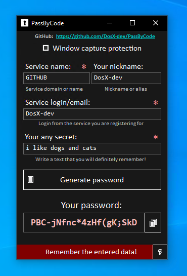

# 🔐🌐 PassByCode

PassByCode is a standalone password generator with a graphical interface for Windows, utilizing cryptographic methods for password generation. 

## 🚀 Features
- **Hash-Based Generation:** PassByCode takes the input data and creates a hash using MD5 as a seed, ensuring a secure password generation process.
- **User-Friendly Interface:** Easily input the required data, and PassByCode will generate a unique password. Forgot your password? Simply re-enter your data.

## 📝 Required Information
PassByCode requires the following information for password generation:
- **Service Name:** The name of the platform or service for which you want to create a password.
- **Your Nickname or Alias (Optional):** You can optionally provide a nickname or alias to personalize your passwords.
- **Service Login/Email:** The login or email associated with the service.
- **Your Any Secret:** Any additional secret information you want to include for added security.

## 🔏 Security
The program offers basic, but highly effective protection against window capturing. With the built-in feature "Window capture protection," it is impossible to screenshot or record the program's window on video.

## ⚙️ Usage
1. Enter the required information.
2. Click on the generate button.
3. Your unique password will be ready for use.

## 🔴 ATTENTION
Remember every character you enter. Any letter or number affects the final password.
Also, **do not provide the data you enter to anyone**.
